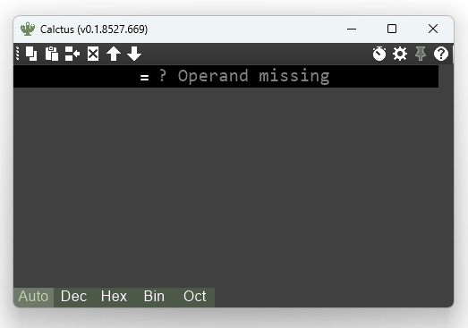
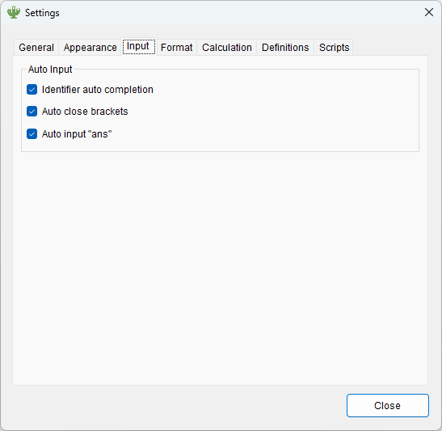
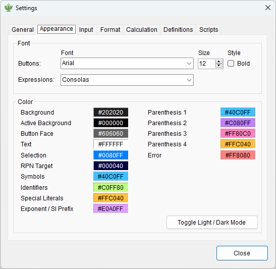

# Calctus

A calculator for Windows.


----

## Download

→ See [releases](https://github.com/shapoco/calctus/releases).

----

## Overview

- Displays the evaluation value of a formula in text format.
- Decimal, hexadecimal, and binary numbers can be mixed.
- The formula history can be referenced with the up key.
- The formula history can be modified, and if so, the calculation results are regenerated.
- Some built-in constants and built-in functions.
- Identifiers/keywords auto-completion.:new:

----

## Features

### Numeric Representations

|Representation|Example|
|:--|--:|
|Decimal|`123`|
|Hexadecimal|`0x7b`, `0x7B`|
|Octadecimal|`0173`|
|Binary|`0b1111011`|
|SI Prefixed:new:|`123k`, `456u`|
|Binary Prefixed:new:|`123ki`, `456Mi`|
|Fraction:new:|`2:3`|
|Character|`'A'`|
|Date Time|`#2022/34/56 12:34:56#`|
|Web Color|`#123`, `#112233`|
|Boolean:new:|`true`, `false`|

### Operators

|Category|Symbol|Precision|
|:--|:--|:--|
|Add, Sub, Mul, Div|`+`, `-`, `*`, `/`|`Decimal`|
|Integral Division|`//`|`Decimal`|
|Remainder|`%`|`Decimal`|
|Power|`^`|`Double`|
|Bit NOT|`~`|`Int64`|
|Bit AND|`&`|`Int64`|
|Bit OR|`\|`|`Int64`|
|XOR|`+\|`|`Int64`|
|Logical Shift|`<<`, `>>`|`Int64`|
|Arithmetic Shift|`<<<`, `>>>`|`Int64`|
|Compare:new:|`>`, `>=`, `<`, `<=`, `==`, `!=`|`Decimal`|
|Logical NOT:new:|`!`|`Boolean`|
|Logical AND:new:|`&&`|`Boolean`|
|Logical OR:new:|`\|\|`|`Boolean`|

### Embedded Functions

|Category|Functions|Precision|
|:--|:--|:--|
|Exponential|`sqrt(x)`, `log(x)`, `log2(x)`, `log10(x)`, `clog2(x)`, `clog10(x)`|`Double`|
|Trigonometric|`sin(x)`, `cos(x)`, `tan(x)`,`asin(x)`, `acos(x)`, `atan(x)`, `atan2(y, x)`,`sinh(x)`, `cosh(x)`, `tanh(x)`|`Double`|
|Round|`floor(x)`, `ceil(x)`, `trunc(x)`, `round(x)`|`Decimal`|
|Absolute/Sign|`abs(x)`, `sign(x)`|`Decimal`|
|Max/Min|`max(...)`, `min(...)`|`Decimal`|
|Sum/Average:new:|`sum(...)`, `ave(...)`, `harmean(...)`, `invsum(...)`, `geomean(...)`|`Decimal`|
|GCD, LCM:new:|`gcd(a, b)`, `lcm(a, b)`|`Decimal`|
|Gray-code:new:|`togray(x)`, `fromgray(x)`|`Int64`|
|Fractions:new:|`frac(x)`, `frac(x,a)`, `frac(x,a,b)`, `real(x)`|`Decimal`|
|Representation|`dec(x)`, `hex(x)`, `bin(x)`, `oct(x)`, `char(x)`, `si(x)`:new:, `bi(x)`:new:, `datetime(x)`|`Decimal`|
|Date Time|`now()`, `fromyears(x)`, `fromdays(x)`, `fromhours(x)`, `fromminutes(x)`, `fromseconds(x)`, `toyears(x)`, `todays(x)`, `tohours(x)`, `tominutes(x)`, `toseconds(x)`|`Double`|
|Color|`rgb(r,g,b)`, `rgb(rgb)`, `hsv2rgb(h,s,v)`, `hsv2rgb_r(h,s,v)`, `hsv2rgb_g(h,s,v)`, `hsv2rgb_b(h,s,v)`, `rgb2hsv_h(rgb)`, `rgb2hsv_s(rgb)`, `rgb2hsv_v(rgb)`, `hsl2rgb(h,s,l)`, `hsl2rgb_r(h,s,l)`, `hsl2rgb_g(h,s,l)`, `hsl2rgb_b(h,s,l)`, `rgb2hsl_h(rgb)`, `rgb2hsl_s(rgb)`, `rgb2hsl_l(rgb)`, `yuv2rgb(y,u,v)`, `yuv2rgb(yuv)`, `yuv2rgb_r(yuv)`, `yuv2rgb_g(yuv)`, `yuv2rgb_b(yuv)`, `rgb2yuv(r,g,b)`, `rgb2yuv(rgb)`, `rgb2yuv_y(rgb)`, `rgb2yuv_u(rgb)`, `rgb2yuv_v(rgb)`|`Decimal`|
|E-series|Rounding to the E-series value: `eXfloor(x)`, `eXceil(x)`, `eXround(x)`<br>Calculation of voltage divider resistance: `eXratiol(x)`, `eXratioh(x)`<br> (`X`=`3`, `6`, `12`, `24`, `48`, `96`, `192`)|`Decimal`|
|Prime Number:new:|`isprime(x)`, `prime(n)`|`Int64`|
|Random:new:|`rand()`, `rand(min, max)`, `rand32()`, `rand64()`|`Decimal`, `Int64`|
|Assertion:new:|`assert(expr)`|`Boolean`|
|Special:new:|`poll(x)`, `alarm(x)`|any|

### Constants

|Symbol|Value|
|:--|--:|
|`PI`|`3.1415926535897932384626433833`|
|`E`|`2.7182818284590452353602874714`|
|`INT_MIN`|`-2,147,483,648`|
|`INT_MAX`|`2,147,483,647`|
|`UINT_MIN`|`0`|
|`UINT_MAX`|`4,294,967,295`|
|`LONG_MIN`|`-9,223,372,036,854,775,808`|
|`LONG_MAX`|`9,223,372,036,854,775,807`|
|`ULONG_MIN`|`0`|
|`ULONG_MAX`|`18,446,744,073,709,551,615`|
|`DECIMAL_MIN`|`-79,228,162,514,264,337,593,543,950,335`|
|`DECIMAL_MAX`|`79,228,162,514,264,337,593,543,950,335`|

User-defined constants can also be used. :new:

### Variables

Variables can be assigned using the equal sign.

```
a = 2 [Return]
b = 3 [Return]
a * b [Return]
// --> Calctus answers 6.
```

### Auto-Completion:new:


### Assertion


### RPN Operations:new:

If only an operator is entered, the expression is "popped" from the history and combined with that operator.

If you use RPN operation, it is recommended to turn off the automatic input of "ans" in the settings.

```
1 [Return]
2 [Return]
+ [Return] // "1" and "2" replaced with "1+2"
3 [Return]
4 [Return]
+* [Return] // "1+2", "3" and "4" replaced with "(1+2)*(3+4)"
```



### Timer:new:


### Keyboard Shortcut

|Key|Function|
|:--|:--|
|`Shift` + `Return`|Insert|
|`Shift` + `Delete`|Delete current expression|
|`Ctrl` + `X`|Cut|
|`Ctrl` + `C`|Copy|
|`Ctrl` + `Shift` + `C`|Copy all expressions and answers|
|`Ctrl` + `V`|Copy|
|`Ctrl` + `Shift` + `V`:new:|Multiline Paste|
|`Ctrl` + `Shift` + `N`:new:|Insert current time|
|`Ctrl` + `Shift` + `Del`|Delete all expressions|
|`Ctrl` + `Shift` + `Up`|Item move up|
|`Ctrl` + `Shift` + `Down`|Item move down|
|`F8`|Radix Mode = Auto|
|`F9`|Radix Mode = Dec|
|`F10`|Radix Mode = Hex|
|`F11`|Radix Mode = Bin|
|`F12`|Radix Mode = Oct|

----

## Settings







----