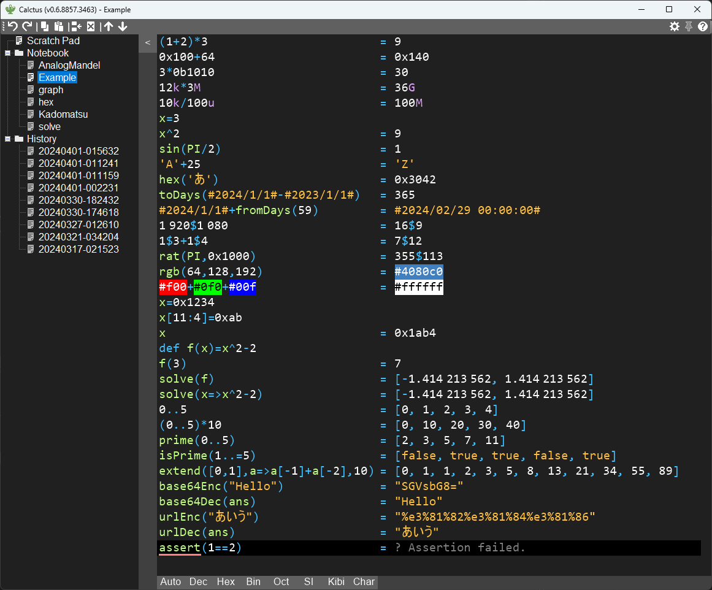
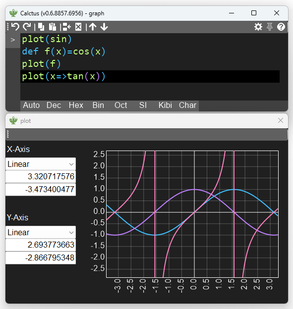

# Calctus

Calctus (カルクタス) is a calculator application for Windows developed for engineers.



----

## Download

→ See [releases](https://github.com/shapoco/calctus/releases).

----

## Overview

- Syntax highlighting and auto-completion.
- Decimal, hexadecimal, and binary numbers can be mixed.
- SI prefixes, datetime formats, RGB color representation and several other formats are also available.
- The formula history can be modified, and the calculation results are immediately regenerated.
- Built-in constants and built-in functions. Constants and functions can also be user-defined.
- Numerical solution of equations by Newton's method.

----

## Features

### Numeric Representations

|Representation|Example|
|:--|--:|
|Decimal|`123`|
|Hexadecimal|`0x7b`, `0x7B`|
|Octadecimal|`0173`|
|Binary|`0b1111011`|
|SI Prefixed|`123k`, `456u`|
|Binary Prefixed|`123ki`, `456Mi`|
|Fraction|`2$3`|
|Character|`'A'`|
|String|`"ABC"`|
|Date Time|`#2022/34/56 12:34:56#`|
|Web Color|`#123`, `#112233`|
|Boolean|`true`, `false`|
|Array|`[1, 2, 3]`|

### Operators

|Category|Symbol|Precision|
|:--|:--|:--|
|Add, Sub, Mul, Div|`+`, `-`, `*`, `/`|`Decimal`|
|Integral Division|`//`|`Decimal`|
|Remainder|`%`|`Decimal`|
|Power|`^`|`Double`|
|Bit NOT|`~`|`Int64`|
|Bit AND|`&`|`Int64`|
|Bit OR|`\|`|`Int64`|
|XOR|`+\|`|`Int64`|
|Logical Shift|`<<`, `>>`|`Int64`|
|Arithmetic Shift|`<<<`, `>>>`|`Int64`|
|Bit/Part Select|`[ ]`, `[ : ]`|`Int64`|
|Compare|`>`, `>=`, `<`, `<=`, `==`, `!=`|`Decimal`|
|Logical NOT|`!`|`Boolean`|
|Logical AND|`&&`|`Boolean`|
|Logical OR|`\|\|`|`Boolean`|
|Conditional Operator|`? :`|`Boolean`|

### Variables

Variables can be assigned using the equal sign.

```c++
a = 2 [Return]
b = 3 [Return]
a * b [Return] // --> Calctus answers 6.
```

### Constants

|Symbol|Value|
|:--|--:|
|`PI`|`3.1415926535897932384626433833`|
|`E`|`2.7182818284590452353602874714`|
|`INT_MIN`|`-2,147,483,648`|
|`INT_MAX`|`2,147,483,647`|
|`UINT_MIN`|`0`|
|`UINT_MAX`|`4,294,967,295`|
|`LONG_MIN`|`-9,223,372,036,854,775,808`|
|`LONG_MAX`|`9,223,372,036,854,775,807`|
|`ULONG_MIN`|`0`|
|`ULONG_MAX`|`18,446,744,073,709,551,615`|
|`DECIMAL_MIN`|`-79,228,162,514,264,337,593,543,950,335`|
|`DECIMAL_MAX`|`79,228,162,514,264,337,593,543,950,335`|

User-defined constants can also be used. 

### Embedded Functions

|Category|Functions|Precision|
|:--|:--|:--|
|Exponential|`pow(x*,y)`, `exp(x*)` :new:, `sqrt(x*)`, `log(x*)`, `log2(x*)`, `log10(x*)`, `clog2(x*)`, `clog10(x*)`|`Decimal`|
|Trigonometric|`sin(x*)`, `cos(x*)`, `tan(x*)`,`asin(x*)`, `acos(x*)`, `atan(x*)`, `atan2(y, x)`,`sinh(x*)`, `cosh(x*)`, `tanh(x*)`|`Double`|
|Round|`floor(x*)`, `ceil(x*)`, `trunc(x*)`, `round(x*)`|`Decimal`|
|Absolute/Sign|`abs(x*)`, `sign(x*)`|`Decimal`|
|Max/Min|`max(x...)`, `min(x...)`|`Decimal`|
|Sum/Average|`sum(x...)`, `ave(x...)`, `harMean(x...)`, `invSum(x...)`, `geoMean(x...)`|`Decimal`|
|GCD, LCM|`gcd(a, b)`, `lcm(a, b)`|`Decimal`|
|Bit/Byte Operations|`swapNib(x)`, `swap2(x)`, `swap4(x)`, `swap8(x)`, `reverseBits(x,w)`, `reverseBytewise(x)`, `rotatel(x,w)`, `rotater(x,w)`, `count1(x,w)`|`Int64`|
|Parity/ECC|`xorReduce(x)`, `oddParity(x)`, `eccWidth(x)`, `eccEnc(x,w)`, `eccDec(e,x,w)`|`Int64`|
|Gray-code|`toGray(x)`, `fromGray(x)`|`Int64`|
|Fractions|`rat(x)`, `rat(x,a)`, `real(x)`|`Decimal`|
|Representation|`dec(x)`, `hex(x)`, `bin(x)`, `oct(x)`, `char(x)`, `si(x)`, `bi(x)`, `datetime(x)`|`Decimal`|
|Date Time|`now()`, `fromDays(x)`, `fromHours(x)`, `fromMinutes(x)`, `fromSeconds(x)`, `toDays(x)`, `toHours(x)`, `toMinutes(x)`, `toSeconds(x)`|`Double`|
|Color|`rgb(r,g,b)`, `rgb(rgb)`, `hsv2rgb(h,s,v)`, `rgb2hsv(rgb)`, `hsl2rgb(h,s,l)`, `rgb2hsl(rgb)`, `yuv2rgb(y,u,v)`, `yuv2rgb(yuv)`, `rgb2yuv(r,g,b)`, `rgb2yuv(rgb)`, `rgbto565(rgb)`, `rgbfrom565(rgb565)`, `pack565(r5,g6,b5)`, `unpack565(rgb565)`|`Decimal`|
|E-series|Rounding to the E-series value: `eXFloor(x)`, `eXCeil(x)`, `eXRound(x)`<br>Calculation of voltage divider resistance: `eXRatio(x)`<br> (`X`=`3`, `6`, `12`, `24`, `48`, `96`, `192`)|`Decimal`|
|Prime Number|`isPrime(x)`, `prime(n)`, `primeFact(x)`|`Int64`|
|Random|`rand()`, `rand(min,max)`, `rand32()`, `rand64()`|`Decimal`, `Int64`|
|Array :new:|`len(array)`|`Array`/`String`|
|Encoding :new:|`utf8Enc(str)`, `utf8Dec(array)`, `urlEnc(str)`, `urlDec(str)`, `base64Enc(str)`, `base64Dec(str)`, `base64EncBytes(array)`, `base64DecBytes(str)`|`Array`/`String`|
|Assertion|`assert(expr)`|`Boolean`|

### User Defined Function 

User functions can be defined using the `def` keyword.

```c++
def f(x) = x^2
f(3) // --> Calctus answers 9.
```

### External Script Call as Functions

Calctus can call scripts such as Python as functions.

Function arguments are passed to the script as command line arguments, and the standard output of the script is returned to Calctus.

1. Open the `Scripts` tab in the Calctus Settings dialog.
2. Check `Enable External Script Functions`.
3. If you want to specify the folder where you want to place the scripts, click the `Change` button to specify the folder.
4. Click the `Open` button. If asked if you want to create the folder, click `Yes`.
5. Place a python script `add.py` like the following in the folder.
    ```python
    import sys
    a = float(sys.argv[1])
    b = float(sys.argv[2])
    print(a + b)
    ```
6. After closing the settings dialog, the `add` function is now available.

If you wish to use a scripting language other than Python, please register the extension and interpreter in the `Scripts` tab of the Settings dialog.

### Solve Function (Newton-Raphson method) 

Use the `solve` keyword to solve equations numerically by Newton's method.

```c++
solve(x^2=2,x) // --> Calctus answers [-1.414213562, 1.414213562].
```

By default, the Newton's method is performed based on automatically generated initial values. Therefore, it may produce inaccurate results if the solution is concentrated in a small area or exists far from the origin.

In such cases, the 3rd argument can be given an initial value.

```c++
solve(sin(x),x,314) // --> Calctus answers 314.159265359.
```

That initial value can also be given as an array.

```c++
solve(sin(x),x,[-314,314]) // --> Calctus answers [-314.159265359, 314.159265359].
```

By providing the 3rd and 4th arguments at the same time, a range of initial values can be specified. In this case, 101 values between these ranges are used as initial values.

```c++
solve(sin(x),x,-5,5) // --> Calctus answers [-3.141592654, 0, 3.141592654].
```

:warning: Note that the solution obtained using the `solve` keyword is an approximation and does not necessarily correspond to the analytical solution.

### Part-selection 

Verilog-style part selection is available for arrays and scalar values.

```c++
array=[1,2,3]
array[1]   // --> Calctus answers 2.
array[1]=5 // --> Calctus answers [1, 5, 3].
```

```c++
x=0x1234
x[11:4]      // --> Calctus answers 0x23.
x[11:4]=0xab // --> Calctus answers 0x1ab4.
```

### Omission of Opening Parentheses 

The opening parenthesis at the beginning of a line can be omitted.

```c++
1+2)*3 // --> Calctus answers 9.
```

### Auto-Completion


### Exponent Adjustment

Exponent-part of E-notation and SI prefix can be adjusted using Alt + Arrow keys.


### Assertion


### RPN Operations

If only an operator is entered, the expression is "popped" from the history and combined with that operator.

If you use RPN operation, it is recommended to turn off the automatic input of "ans" in the settings.

```c++
1 [Return]
2 [Return]
+ [Return] // --> "1" and "2" replaced with "1+2"
3 [Return]
4 [Return]
+* [Return] // --> "1+2", "3" and "4" replaced with "(1+2)*(3+4)"
```


### Graph Plotting

The plot keyword can be used to draw a graph.

:warning: This feature is experimental and may be removed in future versions.



### Keyboard Shortcut

|Key|Function|
|:--|:--|
|`Shift` + `Return`|Insert a new line before current expression|
|`Shift` + `Delete`|Delete current expression|
|`Ctrl` + `Z`|Undo|
|`Ctrl` + `Y`|Redo|
|`Ctrl` + `X`|Cut|
|`Ctrl` + `C`|Copy|
|`Ctrl` + `Shift` + `C`|Copy all expressions and answers|
|`Ctrl` + `V`|Paste (accepts multiple lines)|
|`Ctrl` + `Shift` + `V`|Paste with formatting|
|`Ctrl` + `Shift` + `N`|Insert current time|
|`Ctrl` + `Shift` + `Del`|Delete all expressions|
|`Ctrl` + `Shift` + `Up`/`Down`|Item move up/down|
|`Alt` ( + `Shift` ) + `Left`/`Right`|Move decimal point|
|`Alt` + `Up`/`Down`|Change SI prefix|
|`F1`|Help|
|`F5`|Recalculation|
|`F8`|Radix Mode = Auto|
|`F9`|Radix Mode = Dec|
|`F10`|Radix Mode = Hex|
|`F11`|Radix Mode = Bin|
|`F12`|Radix Mode = SI Prefixed|

----

## Settings


----